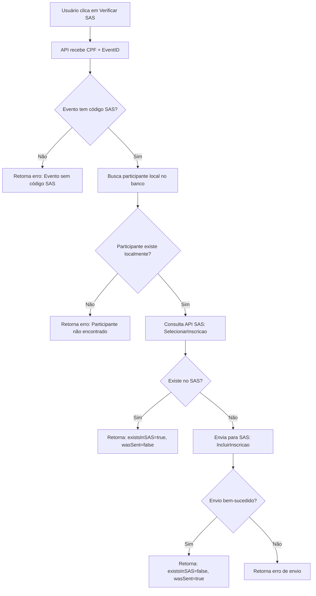

# 🔄 Verificação e Reenvio de Participantes ao SAS

## 📋 Visão Geral

Sistema que permite verificar se um participante está registrado no SAS e reenviar seus dados caso necessário, garantindo sincronização entre o sistema local e o SAS.

---

## 🎯 Funcionalidades

### ✅ Verificação Automática

- Consulta API do SAS para verificar se o participante está registrado no evento
- Endpoint: `SelecionarInscricao` (busca por CPF + CodEvento)
- Retorna status: existe ou não existe no SAS

### 📤 Envio Automático

- Se não existe: envia dados do participante para o SAS
- Se forçar reenvio: atualiza dados no SAS
- Endpoint: `IncluirInscricao` (cria/atualiza inscrição)

### 🔒 Segurança

- Requer autenticação de administrador (NextAuth session)
- Valida se o evento possui código SAS configurado
- Logs detalhados para auditoria

---

## 🖥️ Como Usar (Interface)

### 1. Acessar Painel de Eventos

```
Admin → Eventos → [Selecionar Evento] → Ver Relatório
```

### 2. Localizar Participante

- Navegar até a aba "Participantes"
- Encontrar o participante desejado na lista

### 3. Verificar no SAS

- Clicar no botão **"Verificar SAS"** na coluna de ações
- O botão aparece apenas para participantes credenciados mas não integrados

### 4. Resultados Possíveis

#### ✅ Participante já existe no SAS

```
Mensagem: "✅ Participante já está registrado no SAS!"
Ação: Nenhuma ação necessária
```

#### ⚠️ Participante não existe no SAS

```
Mensagem: "⚠️ Participante não encontrado no SAS. Deseja enviar os dados?"
Ação:
  - Confirmar → Envia dados para o SAS
  - Cancelar → Nenhuma ação
```

#### ✅ Envio bem-sucedido

```
Mensagem: "✅ Participante enviado para o SAS com sucesso!"
Resultado:
  - Dados enviados para o SAS
  - Relatório atualizado automaticamente
```

---

## 🔧 API Endpoint

### POST `/api/admin/events/[id]/verify-sas-participant`

#### Request Body

```json
{
  "cpf": "12345678900",
  "forceResend": false
}
```

#### Parâmetros

- **cpf** (required): CPF do participante (com ou sem formatação)
- **forceResend** (optional): `true` para forçar reenvio mesmo que exista no SAS

#### Response - Participante já existe

```json
{
  "success": true,
  "message": "Participant already exists in SAS",
  "data": {
    "existsInSAS": true,
    "wasSent": false,
    "participant": {
      "cpf": "123.456.789-00",
      "nome": "João Silva",
      "email": "joao@example.com"
    }
  }
}
```

#### Response - Participante enviado

```json
{
  "success": true,
  "message": "Participant sent to SAS successfully",
  "data": {
    "existsInSAS": false,
    "wasSent": true,
    "participant": {
      "cpf": "123.456.789-00",
      "nome": "João Silva",
      "email": "joao@example.com"
    },
    "sasResponse": {
      // Resposta do SAS
    }
  }
}
```

#### Response - Erro

```json
{
  "success": false,
  "message": "Error message",
  "error": "Detailed error description"
}
```

---

## 🔍 Fluxo de Verificação



---

## 📡 Endpoints SAS Utilizados

### 1. SelecionarInscricao (Verificação)

```
GET ${SEBRAE_API_URL}/SelecionarInscricao
Query Params:
  - CgcCpf: CPF do participante
  - CodEvento: Código do evento no SAS
```

**Resposta:**

- `200 + array com dados`: Participante existe
- `200 + array vazio`: Participante não existe
- `404`: Participante não existe

### 2. IncluirInscricao (Envio)

```
POST ${SEBRAE_API_URL}/IncluirInscricao
Body:
{
  "CodEvento": "string",
  "CgcCpf": "string",
  "NomePessoa": "string",
  "Email": "string",
  "Telefone": "string",
  "Cargo": "string",
  "Empresa": "string",
  "Situacao": 1,
  "DataInscricao": "ISO8601"
}
```

**Resposta:**

- `200`: Inscrição criada/atualizada com sucesso
- `4xx/5xx`: Erro ao processar

---

## 🔐 Autenticação

### Headers Necessários

```javascript
{
  'Content-Type': 'application/json',
  'x-req': process.env.SEBRAE_API_KEY
}
```

### Variáveis de Ambiente

```env
NEXT_PUBLIC_SEBRAE_API_URL=https://api.sebrae.com.br/SasServiceCliente/Cliente
SEBRAE_API_KEY=your-api-key-here
```

---

## 🐛 Troubleshooting

### Problema: Botão "Verificar SAS" não aparece

**Causas possíveis:**

1. Participante já está com status "integrado"
2. Participante não está credenciado
3. Evento não possui código SAS

**Solução:**

- Verificar status do participante na coluna "Status"
- Verificar se o evento tem `codevento_sas` configurado

---

### Problema: Erro "Event does not have a SAS code configured"

**Causa:** Evento não possui código SAS vinculado

**Solução:**

1. Editar evento
2. Adicionar campo `codevento_sas`
3. Salvar e tentar novamente

---

### Problema: Erro "Failed to send participant to SAS"

**Causas possíveis:**

1. API SAS indisponível
2. Credenciais inválidas
3. Dados do participante incompletos

**Solução:**

1. Verificar logs do servidor (`[VERIFY_SAS]`)
2. Validar `SEBRAE_API_KEY` no `.env`
3. Verificar se participante possui nome, CPF e email

---

### Problema: Participante enviado mas não aparece no SAS

**Causas possíveis:**

1. Delay na sincronização do SAS
2. Evento não está ativo no SAS
3. CPF com formato incorreto

**Solução:**

1. Aguardar alguns minutos e tentar buscar novamente
2. Verificar status do evento no SAS
3. Consultar logs para ver payload enviado

---

## 📊 Logs e Monitoramento

### Logs da API

Todos os logs possuem prefixo `[VERIFY_SAS]` para fácil filtragem:

```bash
# Ver logs de verificação
grep "\[VERIFY_SAS\]" logs/server.log

# Ver apenas erros
grep "\[VERIFY_SAS\].*Error" logs/server.log
```

### Exemplos de Logs

#### Verificação bem-sucedida

```
[VERIFY_SAS] Request: { eventId: 'abc-123', cpf: '12345678900', forceResend: false }
[VERIFY_SAS] Checking participant in SAS...
[VERIFY_SAS] Participant found in SAS
```

#### Envio necessário

```
[VERIFY_SAS] Request: { eventId: 'abc-123', cpf: '12345678900', forceResend: false }
[VERIFY_SAS] Participant not found in SAS (empty response)
[VERIFY_SAS] Sending participant to SAS...
[VERIFY_SAS] Sending payload to SAS: { CodEvento: '123', CgcCpf: '12345678900', ... }
[VERIFY_SAS] Participant sent to SAS successfully
```

#### Erro

```
[VERIFY_SAS] Request: { eventId: 'abc-123', cpf: '12345678900', forceResend: false }
[VERIFY_SAS] Error checking participant in SAS: SAS API error: 500
[VERIFY_SAS] Error: Internal server error
```

---

## 🧪 Testes Manuais

### Teste 1: Verificar participante existente

1. Acessar evento com código SAS
2. Escolher participante que já foi sincronizado
3. Clicar em "Verificar SAS"
4. **Esperado:** Mensagem "já está registrado no SAS"

### Teste 2: Enviar participante novo

1. Criar participante local que não existe no SAS
2. Credenciar participante no evento
3. Clicar em "Verificar SAS"
4. **Esperado:** Prompt para enviar + mensagem de sucesso

### Teste 3: Forçar reenvio

1. Usar API diretamente com `forceResend: true`
2. **Esperado:** Dados reenviados mesmo que exista no SAS

---

## 🔮 Melhorias Futuras

- [ ] Sincronização em lote (verificar múltiplos participantes)
- [ ] Histórico de verificações e reenvios
- [ ] Dashboard de status de sincronização
- [ ] Retry automático em caso de falha
- [ ] Notificações por email sobre falhas
- [ ] Webhook do SAS para sincronização reversa

---

## 📞 Suporte

Em caso de dúvidas ou problemas:

1. Verificar logs do servidor
2. Consultar documentação da API SAS
3. Contatar equipe de desenvolvimento
